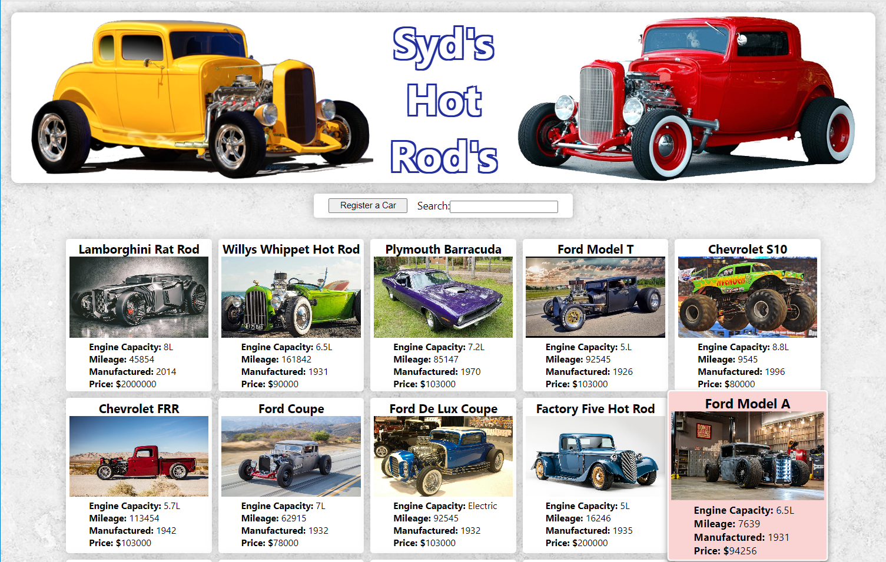

# Syd's Hot Rod's
## About
A car auction/showroom admin system, where you can add, modify & delete cars as they are sold on. \
This is a Full-Stack project that I completed as a Nology Consultant. \
The Front-End is built using JavaScript, React and SCSS, hosted on Netlify. \
The Back-End is built on JAVA with the Spring-Boot Frame-Work that connects to SQL, \
and its all hosted on the Google Cloud Platform GCP.

 

## How to build this app
mkdir nology-fullstack-project-frontend \
cd nology-fullstack-project-frontend \
git clone https://github.com/sydneymurray/nology-fullstack-project-frontend.git \
npm install

## Start front end
Ensure that your .env files contains:- \
REACT_APP_API_URL = http://backend-location \
npm run start

## Please Note
Backend GitHub located at:- \
https://github.com/sydneymurray/nology-fullstack-project-backend